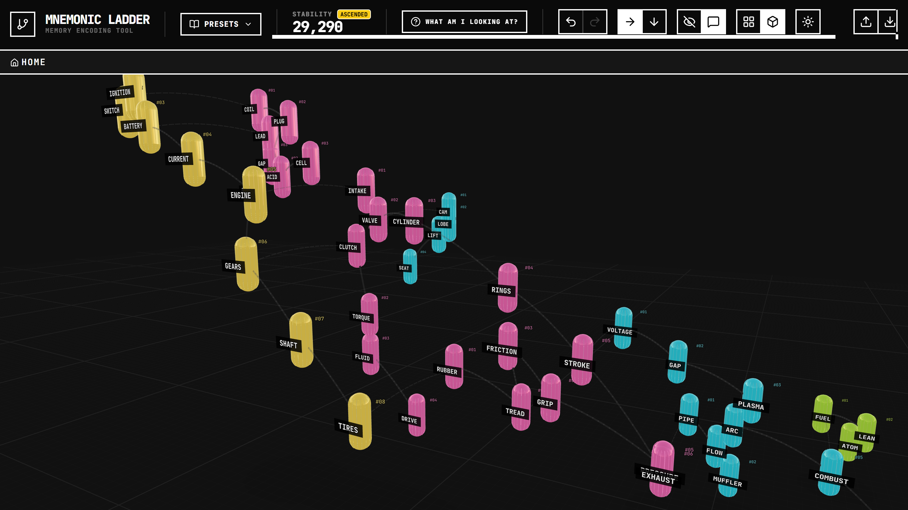
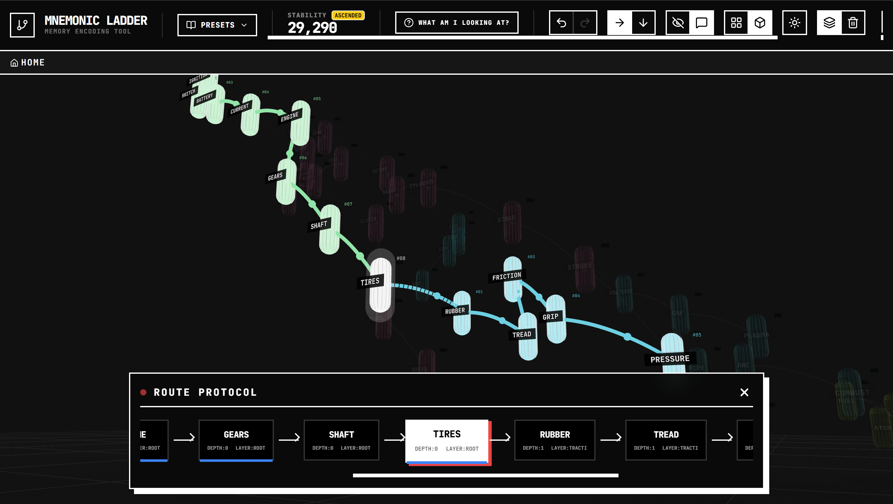

# Mnemonic Ladder

A web-based visual memory encoding tool that merges the ancient **Loci Method (Memory Palace)** with modern **Graph Theory** and **Linked Data** principles.

---

## 🏁 Quickstart Guide: Building a "Car" Engram

Follow these steps to encode your first memory structure:

1.  **Start the Engine**: Click any cell on the infinite grid. A cursor will appear. Type `ENGINE` and press **Enter**.
    *   *Why?* You've just created a "Spatial Anchor". Your brain now associates the word "Engine" with that specific coordinate.
2.  **Interlock the Gears**: Click the 'G' in `ENGINE`. Type `GEARS` and press **Enter**.
    *   *Why?* By interlocking, you've "welded" these concepts together. You can't remember one without the "shape" of the other appearing in your mind.
3.  **The Single Path**: Notice that the tool requires you to connect each word to the *previous* one. Type `SHAFT` off the 'S' in `GEARS`, then `TIRES` off the 'S' in `SHAFT`.
    *   *Why?* This creates a **Narrative Arc**. You are building a road for your memory to follow later.
4.  **Drill Deeper (Laddering)**:
    *   Click on the word `TIRES`.
    *   In the top toolbar (or word list), click the **Enable Ladder** icon.
    *   **Double-click** the word `TIRES` on the grid.
    *   *Why?* You are now *inside* the concept of Tires. You can add `RUBBER`, `TREAD`, and `PRESSURE` here without cluttering the main "Car" view.
5.  **Visualize in 3D**: Click the **3D Map Mode** icon in the top right.
    *   *Why?* Seeing your data as a physical 3D object engages your brain's spatial navigation systems, making the information nearly impossible to "lose".

--

## 🧠 The Concept

**Mnemonic Ladder** is a grid-based workspace where you "interlock" words like a crossword. The goal isn't to solve a puzzle, but to create a physical "shape" (engram) for memory encoding. It transforms abstract information into a spatial, navigable structure.

### 🧱 The Backbone (The Crossword)
Instead of memorizing a flat list of words, you "interlock" them. The spatial relationship (where Word A is horizontal and Word B branches off one of A's letter's vertically) creates a unique visual **engram**. Your brain encodes the shape of the grid just as strongly as the words themselves.

### 🧵 The Hamiltonian Path
The tool enforces a "single path" rule (a Directed Acyclic Graph or linear traversal). Every word must touch the one placed immediately before it. This turns a messy pile of information into a **directed data stream** or a narrative arc. Even if the visual layout looks complex, the underlying story follows one specific, unbreakable line.

### 🪜 Infinite Nesting (Ladders)
This is the implementation of **Linked Data**. Any word in a grid can act as a "Ladder" (a pointer) to a completely new sub-layer. This mirrors how file systems or hyperlinked thoughts work, but visualized as a 2D recursive grid. You can start with a 30,000-foot view of a subject and "drill down" into infinite detail.

---

## 🚀 Key Features

### 🌌 3D Visualization (Map Mode)
Switch from the 2D grid to a **3D Constellation View** (Box icon). This transforms your engrams into a floating universe of capsules. 
- **Depth Perception**: Layers are stacked vertically, allowing you to see the "height" of your knowledge.
- **Dynamic Highlighting**: Selecting a word highlights its entire ancestral chain (where it came from) and its descendants (where it leads).

### 🧵 Route Protocol & Synapse Path
The "Path View" (Eye icon) reveals the invisible thread connecting your thoughts. 
- **The Route Protocol**: A dedicated UI element that shows your current position in the memory chain and allows for rapid navigation through complex engrams.
- **Animated Synapses**: Visual pulses flow between words in the order they were encoded, reinforcing the sequential memory.

---

## 👶 ELI5: Why this works

### 1. The "Sticky" Factor (Engrams)
Standard lists are boring; your brain hates them. But your brain loves spatial layouts and weird shapes. By forcing words to interlock, you aren't just remembering "Apple, Dog, House", you're remembering a unique visual "staircase" or L-shape made of those words. This visual trace is called an **engram**, and it's much harder to forget than flat text.

### 2. The "Breadcrumb" Rule (The Single Path)
This rule turns information into a movie script. Because every word must touch the one before it, you create a "narrative arc." If you remember the first word, your brain naturally "follows the track" to the next one because they are physically welded together in the grid. You can't get lost because there’s only one road.

### 3. The "Inception" Effect (Nesting)
Imagine one word in your grid is "Calculus." You double-click it, and it opens a whole new grid just for Calculus terms. You’re building a **Fractal Mind Map**. You can organize infinite information without feeling overwhelmed by zooming in and out of nested layers.

---

## 🛠️ Technical Stack

- **Core**: [React 19](https://react.dev/) + [Vite](https://vitejs.dev/)
- **3D Engine**: [React Three Fiber](https://docs.pmnd.rs/react-three-fiber) + [Three.js](https://threejs.org/)
- **Language**: [TypeScript](https://www.typescriptlang.org/)
- **State Management**: [Zustand](https://github.com/pmndrs/zustand) (with persistence and undo/redo support)
- **Styling**: [Tailwind CSS](https://tailwindcss.com/) (Brutalist aesthetic)
- **Viewport/UX**: [react-zoom-pan-pinch](https://github.com/BetterTyped/react-zoom-pan-pinch) for the infinite canvas experience
- **Icons**: [Lucide React](https://lucide.dev/)
- **Utilities**: `clsx`, `tailwind-merge`
